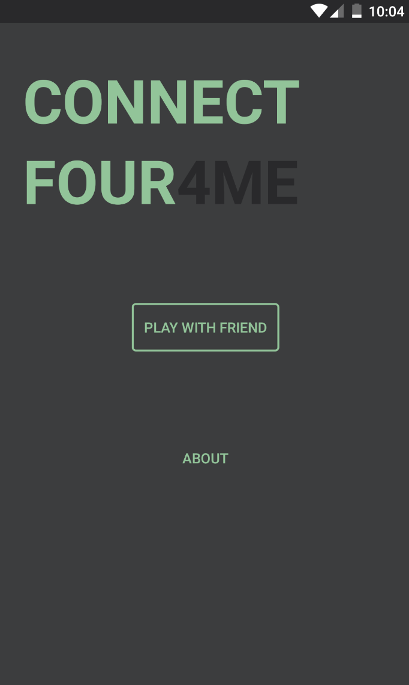
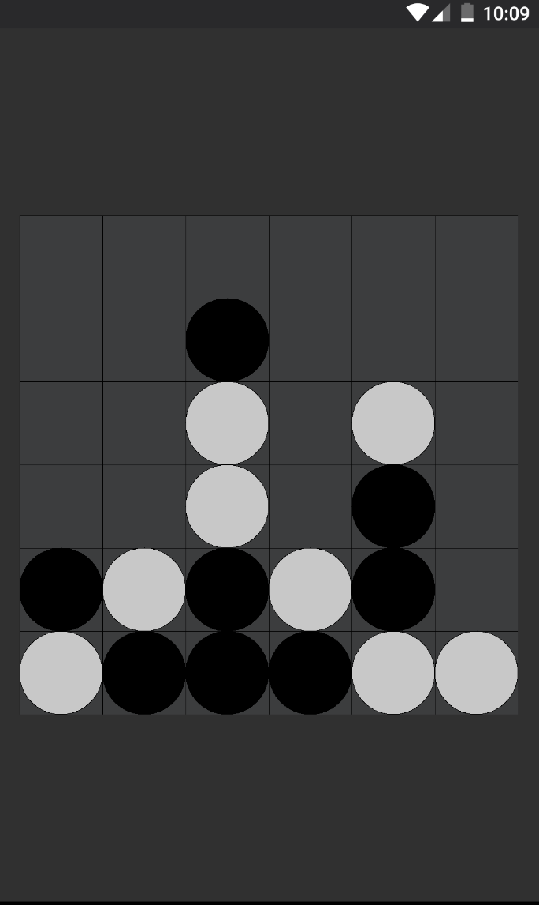

<h1 align="center"> 🌑  🌒  🌓  🌔 4 me 🌖  🌗  🌘 🌑 </h1>

Simple implementation of Connect Four game with hotseat mode

### About Game
`Wikipedia:` Connect Four gameplay where the first player begins by dropping his/her yellow disc into the center column of the game board. The two players then alternate turns dropping one of their discs at a time into an unfilled column, until the second player, with red discs, achieves four discs in a row, diagonally, and wins. If the game board fills before either player achieves four in a row, then the game is a draw.

### TODO
- AI mode 👽
- AI difficulty levels :feelsgood: :finnadie: :goberserk:

---

### ✨Thanks✨
implement with this [great tutorial](https://www.youtube.com/watch?v=CbKJqeOxQQ4&list=LLsEprLTBqYvbN0Bqp9aYgQw&index=12)
